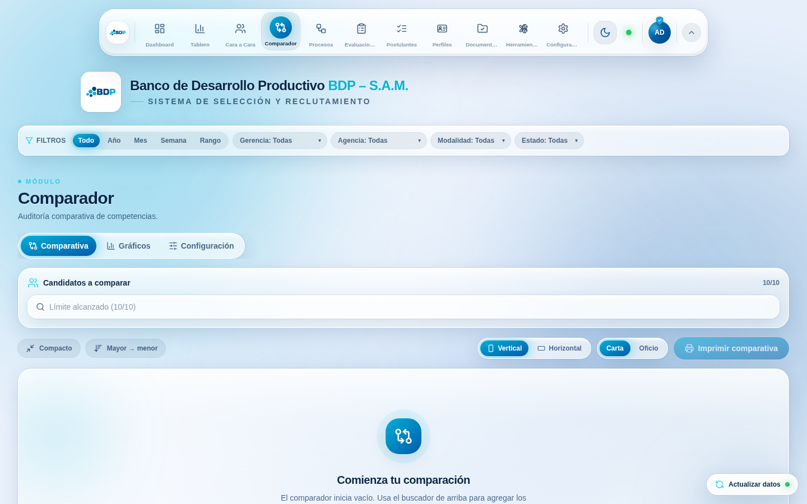
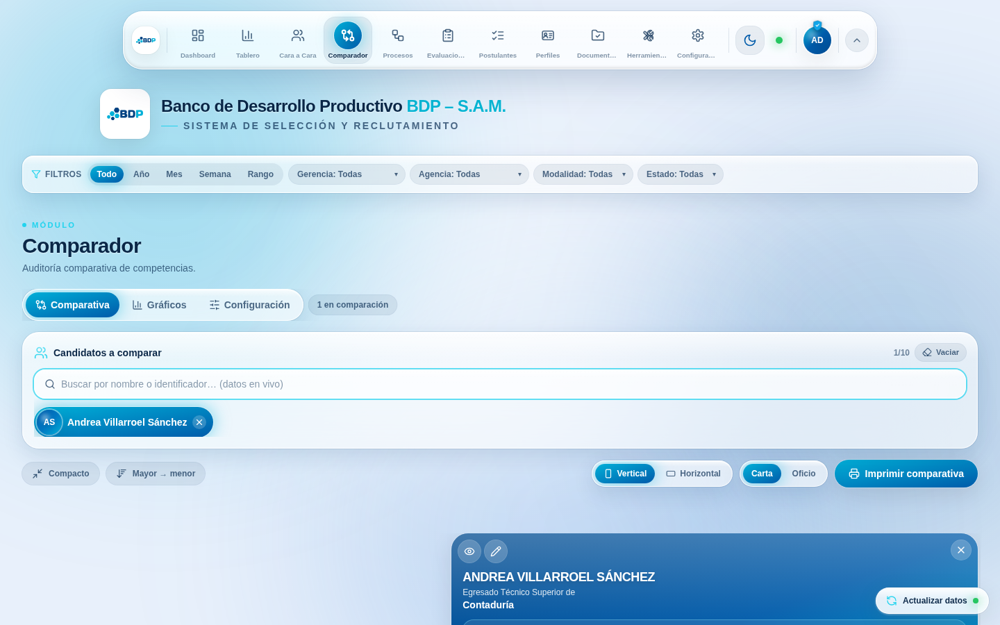
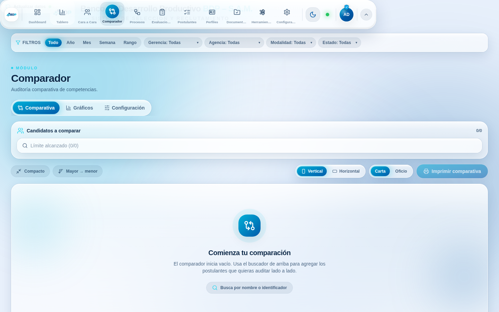
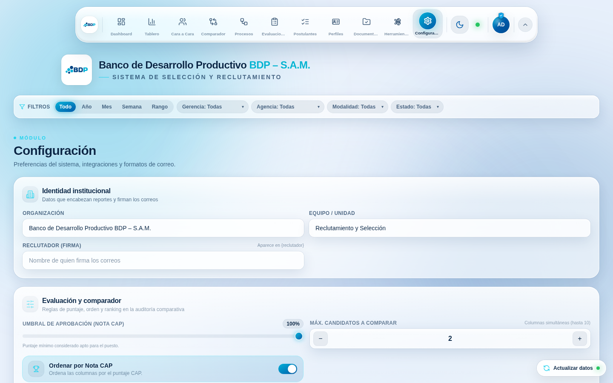
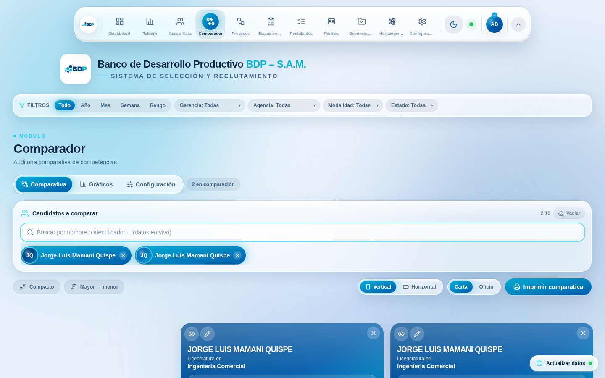
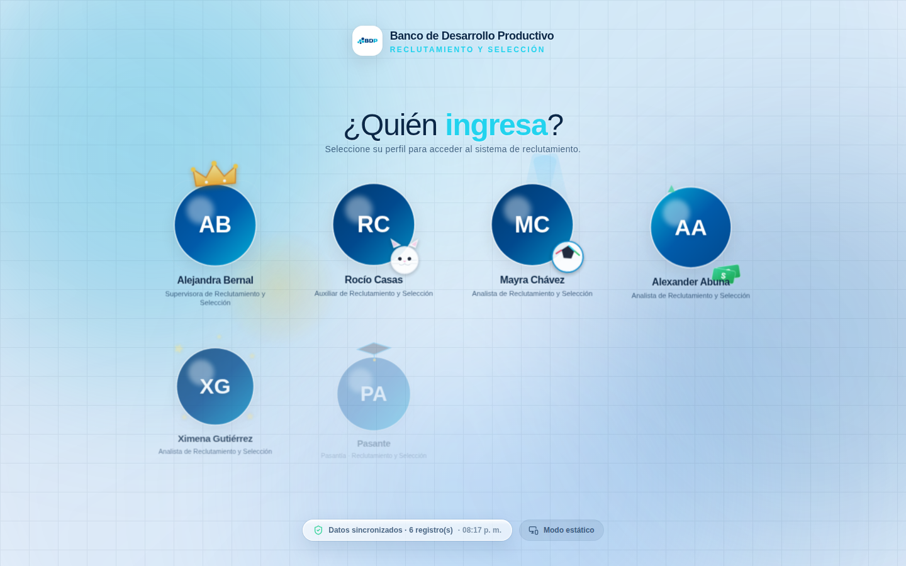
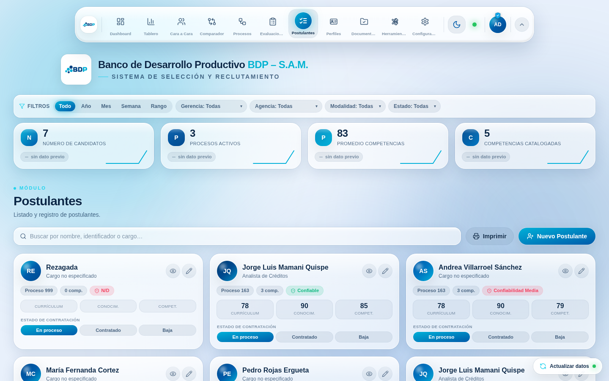
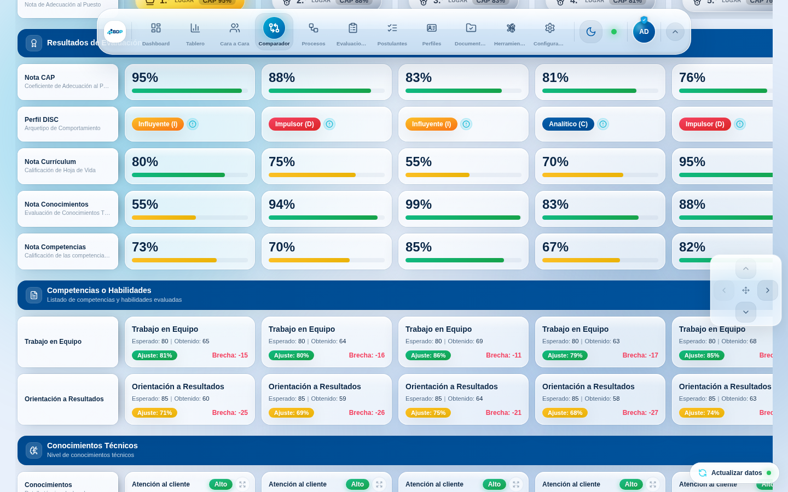
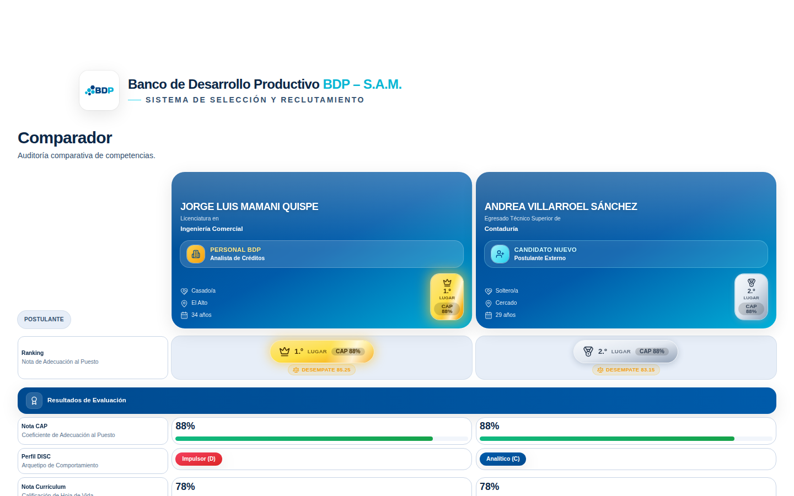
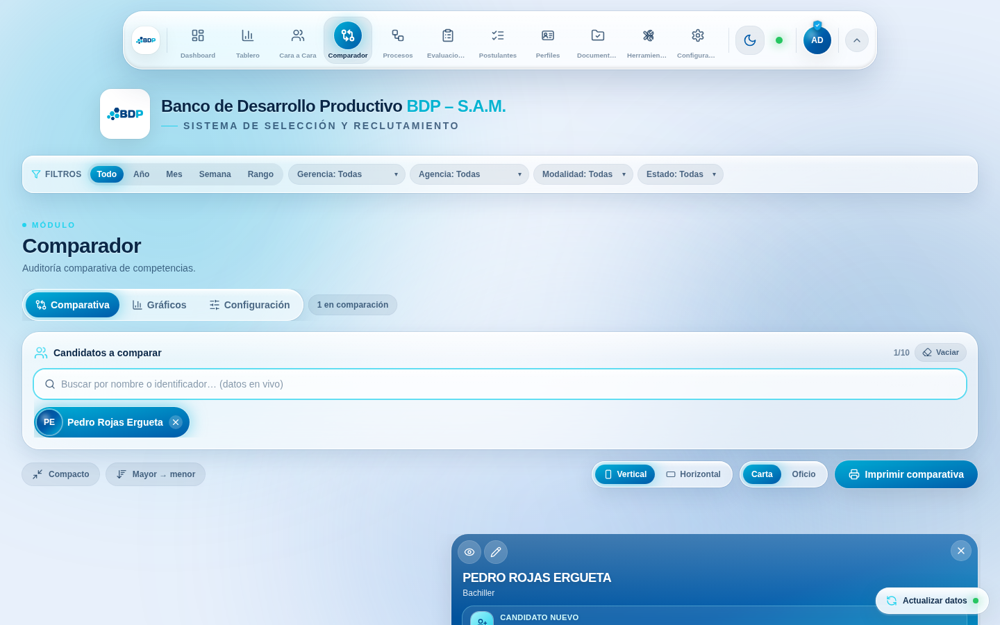

# Auditoría de estabilidad — Comparador y Postulantes (agosto de 2026)

> **Resumen para quien tiene prisa.** El usuario que se queja no está mintiendo.
> Hay **diez defectos reales** —cuatro de ellos capaces de dejar el Comparador
> inservible o de perder el registro de un postulante— y los principales comparten
> una misma raíz: **la aplicación confiaba en datos que no controla** (lo que
> guardó el navegador, lo que el perfil dejó en la hoja, lo que responde el
> backend). Los diez están corregidos, reproducidos primero en un navegador real y
> cubiertos con pruebas que fallan si alguien los reintroduce.
>
> Lo más importante: tres de ellos **sólo se manifiestan en el equipo o el perfil
> de una persona**, así que eran invisibles para quien probaba desde otra cuenta u
> otra computadora. Eso explica por completo el reporte que parecía imposible de
> reproducir.

- [1. Contexto](#1-contexto)
- [2. Intuición: por qué a una sola persona](#2-intuición-por-qué-a-una-sola-persona)
- [3. Hallazgos](#3-hallazgos)
- [4. El código, cambio por cambio](#4-el-código-cambio-por-cambio)
- [5. Verificación](#5-verificación)
- [6. Qué revisar en la computadora de esa persona](#6-qué-revisar-en-la-computadora-de-esa-persona)
- [7. Alternativas consideradas](#7-alternativas-consideradas)
- [8. Con quién conviene consultar](#8-con-quién-conviene-consultar)
- [9. Lo que queda pendiente (y por qué no se tocó)](#9-lo-que-queda-pendiente-y-por-qué-no-se-tocó)
- [10. Cuestionario](#10-cuestionario)

---

## 1. Contexto

### 1.1 Para quien llega de cero (sáltese esta parte si ya conoce el sistema)

La aplicación es un **frontend sin servidor propio**. Todo el estado permanente
vive en un libro de Google Sheets, y el puente entre el navegador y la hoja es un
*web app* de Google Apps Script cuya URL está en
[`src/constants.ts`](../../src/constants.ts):

```
GET  https://script.google.com/…/exec   →  { candidatos, competencias, auxiliares, … }
POST https://script.google.com/…/exec   →  { status: "success" | "error", message }
```

Tres consecuencias de esa arquitectura, que son el trasfondo de toda esta
auditoría:

1. **No hay validación de servidor propia.** Lo que la hoja acepte, se guarda; y
   lo que la hoja tenga, se dibuja. Si dos filas comparten identificador, el
   frontend es el único lugar donde ese problema puede detectarse.
2. **El estado de la interfaz vive en el navegador.** Preferencias
   (`localStorage`), la comparación en curso (`sessionStorage`), la sesión del
   perfil (una cookie). Todo eso es **por equipo y por persona**: dos analistas
   ven los mismos datos y, aun así, pueden tener experiencias distintas.
3. **Las escrituras son de ida y vuelta lenta.** Apps Script cachea la lectura y
   la hoja tarda en propagar, así que «guardado» y «visible» no ocurren en el
   mismo instante.

Los dos módulos de esta entrega son los dos extremos del mismo proceso:

- **Postulantes** ([`src/modules/RegistrationForm.tsx`](../../src/modules/RegistrationForm.tsx))
  es la puerta por la que entran todos los datos: un cuestionario largo con
  velocímetros, arquetipo DISC, tres constructores de listas y escalas de
  riesgo.
- **Comparador** ([`src/modules/NuevoComparador.tsx`](../../src/modules/NuevoComparador.tsx))
  es la mesa donde se decide: una cuadrícula de auditoría que pone hasta diez
  postulantes lado a lado, calcula el puesto por mérito y se imprime.

### 1.2 El contexto específico de este cambio

Existía un reporte recurrente de **una sola persona** del equipo: «el comparador
no funciona» y «no puedo añadir postulantes». Quien lo revisó probó en varios
dispositivos y no pudo reproducirlo. Eso deja tres hipótesis posibles, y hubo que
descartarlas por orden:

| Hipótesis | Cómo se descarta |
| --- | --- |
| El reporte es falso | Reproduciendo el fallo en un navegador real |
| Es un problema del equipo de esa persona | Sembrando el estado de *su* navegador |
| Es un defecto del código para todos | Corriendo la misma prueba en limpio |

Para poder hacer eso hacía falta algo que el repositorio no tenía: **un entorno
donde el sistema se pueda operar de verdad** con un backend que se pueda romper a
voluntad. Es la primera pieza de esta entrega
([`scripts/qa/`](../../scripts/qa/README.md)) y con ella los tres reportes
«imposibles» se reprodujeron en minutos.

> [!IMPORTANT]
> **Reproducir antes que arreglar.** Cada defecto de esta entrega tiene un
> escenario que **falla en `main` y pasa en la rama**. Sin ese paso, un arreglo
> es una conjetura con buena letra.

---

## 2. Intuición: por qué a una sola persona

La idea central cabe en una frase: **la aplicación trataba como confiables tres
entradas que no controla**.

```
        ┌───────────────────────────┐
        │  Lo que guardó ESTE       │  sessionStorage: comparación en curso
        │  navegador                │  localStorage:   preferencias, borradores
        └────────────┬──────────────┘
                     │  se aplicaba tal cual, sin validar
        ┌────────────┴──────────────┐
        │  Lo que guardó ESTE       │  hoja «Perfiles_y_Configuracion»,
        │  perfil en la hoja        │  columna config_personal_perfil
        └────────────┬──────────────┘
                     │  se aplicaba al iniciar sesión, sin validar
        ┌────────────┴──────────────┐
        │  Lo que respondió el      │  {status:"error"}, HTML de error, 500,
        │  backend                  │  o nada (petición colgada)
        └───────────────────────────┘
                     │  no se miraba: todo era «éxito»
```

Las tres son **por persona**. Y de ahí sale exactamente el cuadro descrito:

- La comparación se guarda por identificador en `sessionStorage`. Si la hoja
  corrige o borra una de esas filas, el identificador queda **huérfano** pero
  sigue ocupando una de las diez columnas. Con diez huérfanos el buscador se
  apaga con «Límite alcanzado (10/10)» sobre una comparativa vacía. Vive en la
  pestaña de esa persona; nadie más lo ve, y al cerrar la pestaña desaparece
  —así que tampoco se puede mostrar cuando alguien viene a mirar—.
- La configuración personal viaja **en la hoja** (`config_personal_perfil`) y se
  aplica al iniciar sesión en cualquier equipo. Un `maxComparador: 0` guardado
  ahí —por una versión anterior, un ajuste a medias o una edición manual de la
  hoja— sigue a esa persona a todas partes: buscador apagado, «(0/0)». Al resto
  del equipo no le pasa nada.
- Y si el navegador de esa persona tiene **el almacenamiento del sitio
  bloqueado** (política de empresa, «bloquear todas las cookies», modo privado de
  Safari), la aplicación no se degradaba: se quedaba **en blanco**, porque el tema
  se leía sin protección por encima de toda frontera de error.

La otra mitad del problema estaba en el lado opuesto del viaje. La escritura de
un postulante era un `fetch` **sin comprobar nada**:

```ts
// antes
await fetch(SCRIPT_URL, { method: "POST", /* … */ });
setRaw((prev) => [candidate, ...prev]);      // se agrega igual
return { ok: true, message: "Postulante registrado correctamente." };
```

Así, un rechazo del backend («identificador repetido», hoja bloqueada,
despliegue caducado) se anunciaba como éxito, el cuestionario se cerraba y el
trabajo se perdía; un corte de red dejaba una **fila fantasma** que desaparecía
al siguiente refresco; y una petición colgada dejaba el botón en «Guardando…»
para siempre. Tres formas distintas de que un analista diga, con razón, «registré
a alguien y no se guardó».

---

## 3. Hallazgos

| # | Defecto | Efecto para quien opera | Alcance | Estado |
| --- | --- | --- | --- | --- |
| 1 | Sesión del comparador con identificadores huérfanos | «Límite alcanzado (10/10)» y comparativa vacía: **no se puede comparar a nadie** | Una persona, una pestaña | Corregido |
| 2 | Configuración personal aplicada sin validar (`localStorage` y hoja) | «Límite alcanzado (0/0)», maquetación descuadrada y, con un `dockSize` inválido, **aplicación caída** | Una persona, en todos sus equipos | Corregido |
| 3 | Almacenamiento del sitio bloqueado | **Pantalla en blanco total** | Un navegador / una política de TI | Corregido |
| 4 | Escritura sin comprobar la respuesta | Un rechazo del servidor se anuncia como éxito y **se pierde la ficha** | Todos | Corregido |
| 5 | Fila fantasma al fallar la escritura | La ficha «aparece» y se borra sola al refrescar | Todos | Corregido |
| 6 | La hoja tarda en devolver la fila recién escrita | El postulante recién registrado **desaparece de la lista** | Todos | Corregido |
| 7 | Identificador repetido en la hoja | La segunda ficha es **inalcanzable**; editar sobrescribe a la primera | Todos, con datos duplicados | Corregido |

| 8 | Ámbito de impresión pegado al documento | La **siguiente** impresión sale con el ámbito equivocado: la Lista de Postulantes, sin encabezado y con las reglas de la cuadrícula | Todos, tras cancelar un diálogo de impresión | Corregido |
| 9 | Efectos rearmados en cada dibujado (`Modal`, visor de celda) | Dos escrituras de `document.body.style` **por pulsación** y escuchadores de teclado montados y desmontados sin parar | Todos, al escribir en el cuestionario | Corregido |
| 10 | Observadores de tamaño recreados en cada dibujado (celdas de texto largo) | Con treinta celdas, sesenta `ResizeObserver` destruidos y recreados por cambio de vista | Todos, en la comparativa | Corregido |

Y tres defectos menores encontrados en el camino: el velocímetro no permitía
**borrar** una nota (una nota puesta por error se quedaba en el expediente), el
buscador del comparador se quedaba **sin nombre accesible** al alcanzar el tope, y
la recuperación del borrador del constructor de evaluaciones podía **tumbar el
módulo** si la copia local estaba dañada. En Procesos, además, la barra de vistas
provocaba unos 60 px de desborde horizontal en un teléfono.

### 3.1 El defecto 1, en imágenes

Sembrando en `sessionStorage` diez identificadores que la hoja ya no tiene —lo
que ocurre al corregir identificadores o borrar duplicados— el módulo queda así:



Diez de diez columnas ocupadas por gente que no existe, buscador apagado y la
pantalla de bienvenida debajo. Con la reconciliación, la misma sesión sucia se
limpia sola y el módulo vuelve a ser usable:



### 3.2 El defecto 2, en imágenes

Con una configuración personal corrupta guardada **en la hoja** y aplicada al
iniciar sesión (`maxComparador: 0`, `dockPosition: "arriba"`):



Nótese que no es sólo el buscador: al no ser `"arriba"` una posición válida, el
contenido pierde su margen y **el dock se monta sobre el encabezado**. Tras
sanear la configuración en su única puerta de entrada:



### 3.3 Los defectos 4 y 7, en una sola pantalla


Dos cosas nuevas conviven aquí: el **aviso ámbar** bajo el identificador («ya
existe un registro con este identificador») y el **motivo real del rechazo** en el
pie, con el cuestionario **abierto** y el avance intacto. Antes, esta misma
situación cerraba el modal anunciando éxito.

### 3.4 El defecto 7, del lado del comparador



Las dos filas con el identificador `5033853-163-2026` (CAP 88 y CAP 91) se pueden
comparar simultáneamente. Antes, agregar la primera hacía desaparecer la segunda
del buscador («Sin coincidencias para "Jorge"»), de modo que sus notas eran
inaccesibles desde toda la aplicación.

### 3.5 El defecto 3



Con `localStorage` y `sessionStorage` lanzando `SecurityError` en cada acceso, la
aplicación arranca y es utilizable; sólo deja de recordar preferencias entre
visitas.

---

## 4. El código, cambio por cambio

### 4.1 Un almacenamiento que no puede lanzar

El defecto 3 tenía una raíz de una línea. En algunos navegadores no basta con
envolver `setItem`: **acceder a la propiedad** ya lanza.

```ts
// src/context/ThemeContext.tsx — antes
const stored = window.localStorage.getItem(STORAGE_KEY);   // 💥 SecurityError
```

`ThemeProvider` es el componente más externo de la aplicación, por encima de
cualquier `ErrorBoundary`, así que esa excepción se llevaba por delante el árbol
entero antes de pintar un píxel. Curiosamente, el script anti-FOUC de
`index.html` **sí** estaba protegido: alguien pensó en el caso, pero sólo en el
HTML.

La solución es un módulo diminuto,
[`src/shared/safeStorage.ts`](../../src/shared/safeStorage.ts), que centraliza los
accesos y **nunca lanza**:

```ts
export const safeLocal = wrap(() =>
  typeof window === "undefined" ? null : window.localStorage,
);
```

Se aplicó en los cuatro sitios que estaban sin protección —el tema, la captura
del paquete de preferencias del perfil, las cookies de sesión y el borrador del
constructor de evaluaciones— y de paso reemplazó los `try/catch` repetidos de los
almacenes de configuración, tablero y caché de datos.

### 4.2 La configuración se sanea en su única puerta de entrada

El defecto 2 no se arregla en el Comparador. Se arregla donde entra el dato:

```ts
// src/lib/configStore.ts
export function sanitiseConfig(
  patch: Partial<AppConfig> | null | undefined,
  base: AppConfig = defaultConfig(),
): AppConfig {
  // …
  maxComparador: has("maxComparador")
    ? clampNumber(patch.maxComparador, 2, 10, base.maxComparador)
    : keep("maxComparador"),
  rankPlacement: has("rankPlacement")
    ? pickOption(patch.rankPlacement, RANK_PLACEMENTS, base.rankPlacement)
    : keep("rankPlacement"),
  // …
}
```

Y se usa en **los dos** caminos por los que llega configuración:

```ts
function load(): AppConfig { /* … */ return sanitiseConfig(migrated, base); }

export function setConfig(patch: Partial<AppConfig>): void {
  state = sanitiseConfig(patch, state);   // ← aquí entra lo que guardó el perfil
  emit();
}
```

`setConfig` era el agujero: `applyBundle` (en
[`profilesStore`](../../src/lib/profilesStore.ts)) aplica ahí el
`config_personal_perfil` que la hoja devuelve al iniciar sesión, y hasta ahora lo
hacía sin mirar. El saneador es **estricto por construcción**: arma un objeto
explícito, así que una clave que ya no existe en la aplicación se descarta en vez
de quedarse rondando.

> [!IMPORTANT]
> **Un valor imposible no es un detalle cosmético.** `SIZE[dockSize]` y
> `MAIN_PAD[dockPosition]` son búsquedas en tablas: con una clave inválida, la
> primera devuelve `undefined` y `sz.plate` **lanza** en un componente que vive
> por encima de toda frontera de error. Acotar en la entrada evita una familia
> entera de fallos, no sólo el que se reportó.

Con la misma lógica, `importLayout` del tablero descarta ahora los elementos que
no son objetos: un `null` en la lista guardada lanzaba `TypeError` **en medio del
inicio de sesión**, el peor lugar posible para fallar. Y `applyBundle` quedó
envuelto, de modo que un paquete corrupto no pueda impedir entrar.

### 4.3 La sesión del comparador se reconcilia con la hoja

```ts
// src/lib/comparatorStore.ts
export function reconcileComparator(knownIds: Iterable<string>): void {
  const known = new Set(knownIds);
  if (known.size === 0) return;          // la base aún no cargó: no tocar nada
  const kept = state.selectedIds.filter((id) => known.has(id));
  if (kept.length === state.selectedIds.length) return;
  state = { ...state, selectedIds: kept };
  emit();
}
```

La guarda de la base vacía es importante: sin ella, un fallo de red vaciaría la
comparación del analista, que es justo lo contrario de lo que se busca. El módulo
la invoca cuando la base cambia, y el buscador dejó de medir el tope contra los
identificadores guardados para medirlo contra los **resueltos**:

```ts
// src/components/CandidateSearchSelect.tsx
const limit = Number.isFinite(max) && max >= 2 ? Math.floor(max) : 10;
const full = selected.length >= limit;   // antes: selectedIds.length >= max
```

Además el buscador gana una **salida de emergencia visible** —un botón «Vaciar»
junto al contador— porque quien se queda con el tope lleno necesita el botón a la
vista y no escondido en la pestaña de Configuración.

### 4.4 Escribir en la hoja y comprobar que se guardó

```ts
// src/context/TalentDataContext.tsx
async function writeToScript(body: Record<string, unknown>) {
  const controller = new AbortController();
  const timer = setTimeout(() => controller.abort(), WRITE_TIMEOUT_MS); // 25 s
  try {
    const res = await fetch(SCRIPT_URL, { /* … */ signal: controller.signal });
    if (!res.ok) return { ok: false, message: `…HTTP ${res.status}…` };
    const text = await res.text();
    // Un despliegue mal publicado responde HTML con código 200.
    let envelope = null;
    try { envelope = text ? JSON.parse(text) : null; } catch { envelope = null; }
    if (envelope === null && text.trim() !== "") return { ok: false, message: "…" };
    if (envelope?.status && envelope.status !== "success") {
      return { ok: false, message: envelope.message || "El servidor rechazó la operación." };
    }
    return { ok: true, message: envelope?.message ?? "Operación registrada." };
  } catch (err) { /* AbortError ⇒ «tardó demasiado» */ }
  finally { clearTimeout(timer); }
}
```

Cuatro puertas cerradas: **tiempo límite**, **código HTTP**, **respuesta que no
es JSON** y **sobre con `status: "error"`**, cuyo mensaje se muestra tal cual
porque lo escribe el backend pensando en quien opera. La capa nueva de ProcessOS
([`providers/google-apps-script/client.ts`](../../src/infrastructure/providers/google-apps-script/client.ts))
ya hacía esto bien; el contexto histórico se había quedado atrás.

Con eso, `submitCandidate` puede ser honesto:

```ts
const result = await writeToScript(candidate);
if (!result.ok) {
  // Antes se insertaba la fila igual: el analista la veía «guardada» y
  // desaparecía al siguiente refresco, sin quedar en ninguna parte.
  return { ok: false, message: `${result.message} Su avance sigue en el formulario.` };
}
```

### 4.5 Una escritura confirmada no puede desaparecer

El defecto 6 es el más sutil, porque nadie hizo nada mal: el backend confirma, y
la lectura siguiente todavía no trae la fila (Apps Script cachea el `doGet`). El
módulo de Postulantes refresca justo después de guardar, así que el postulante
recién registrado **se borraba de la pantalla**.

La respuesta es una cola de escrituras confirmadas que sobrevive incluso a una
recarga:

```ts
const PENDING_KEY = "bdp-talent-pendientes";
const PENDING_TTL_MS = 24 * 60 * 60 * 1000;

/** Añade a la carga las filas confirmadas que la hoja aún no devuelve. */
function mergePending(rows: RawCandidate[], pending: PendingWrite[]): RawCandidate[] {
  const present = new Set(rows.map(identOf));
  const missing = pending.filter((p) => !present.has(identOf(p.row)));
  return missing.length ? [...missing.map((p) => p.row), ...rows] : rows;
}
```

Cada lectura suelta las filas que la hoja ya devuelve, y el día de vida máxima
evita que un problema del servidor deje una ficha colgada para siempre.



### 4.6 Identificadores repetidos: dos filas, dos identidades

El `id` de un postulante es su identificador, pero la hoja no impone que sea
único. Con el `id` repetido, la aplicación trataba dos filas como una sola
persona y las consecuencias eran silenciosas: el comparador dejaba de ofrecer la
segunda ficha, «Ver perfil» y «Editar» abrían siempre la primera, y React
recibía dos hijos con la misma `key`.

```ts
// src/lib/candidates.ts
export function normaliseCandidates(rows: RawCandidate[]): Candidate[] {
  const seen = new Map<string, number>();
  return rows.map((row, index) => {
    const candidate = normaliseCandidate(row, index);
    const previous = seen.get(candidate.id) ?? 0;
    seen.set(candidate.id, previous + 1);
    if (previous === 0) return candidate;
    return { ...candidate, id: `${candidate.id}#${previous + 1}` };
  });
}
```

La **primera** aparición conserva el identificador tal cual, así que las sesiones
y preferencias ya guardadas siguen siendo válidas; el campo `identificador` no se
toca, porque es lo que viaja al backend.

Eso arregla la lectura, pero no la escritura: el backend edita la **primera** fila
que coincide, así que guardar desde la segunda ficha sobrescribiría a la primera.
Ahí la única respuesta honesta es detenerse:

```ts
const homonimas = rawRef.current.filter((c) => identOf(c) === id).length;
if (homonimas > 1) {
  return {
    ok: false,
    message: `Hay ${homonimas} filas con el identificador ${id} en la hoja. ` +
      `Corrija el duplicado antes de editar: el guardado modificaría la primera de ellas.`,
  };
}
```

Y para cortar el problema en su origen, el cuestionario **avisa** (sin bloquear:
a veces el duplicado es intencional) cuando el identificador que se está
escribiendo ya existe en la base.

### 4.7 Tres fugas de rendimiento del mismo tipo

Las tres nacen de la misma costumbre: dejar en las dependencias de un efecto algo
cuya identidad cambia en cada dibujado.

```ts
// src/components/Modal.tsx — antes
}, [open, onRequestClose]);   // ← una lambda nueva por dibujado
```

`onRequestClose` se declara en el cuerpo de quien llama, así que **cada pulsación
en el cuestionario** desmontaba el escuchador de Escape y reescribía
`document.body.style.overflow` —dos escrituras de estilo por tecla sobre un árbol
de cuarenta campos—. Se separan en dos efectos: el bloqueo del desplazamiento
depende sólo de `open`, y el atajo lee el callback vigente desde una referencia.
El visor de celda ampliada del comparador tenía el mismo patrón, con el añadido de
reprogramar el foco sin parar.

En las celdas de texto largo el problema eran los arreglos:

```ts
// src/components/comparator/LongTextCell.tsx
const contentKey = useMemo(/* firma del contenido */);
useEffect(() => { /* … */ }, [contentKey]);   // antes: [items, tags]
```

`items` y `tags` tienen un `[]` por omisión y quien llama construye las etiquetas
al dibujar, así que su identidad cambiaba siempre: con treinta celdas en pantalla,
cualquier cambio de estado del comparador destruía y recreaba sesenta
`ResizeObserver`.

### 4.8 La impresión ya no contamina la siguiente

```ts
// src/lib/print.ts
clearPrintArtifacts();                       // ← ahora también AL EMPEZAR
if (scopeClass) document.body.classList.add(SCOPED_CLASS, scopeClass);
```

La limpieza colgaba sólo de `afterprint`, y ese evento no siempre llega (diálogo
cancelado, impresión intervenida por política). Cuando no llegaba, la clase de
ámbito se quedaba pegada al `<body>`: en pantalla no se nota, porque esas reglas
viven dentro de `@media print`, pero **la impresión siguiente heredaba el ámbito
equivocado** y la Lista de Postulantes salía sin encabezado institucional y con
las reglas de la cuadrícula del comparador.

### 4.9 Detalles de oficio

- **El velocímetro admite «sin evaluar».** Borrar el número dejaba el valor
  anterior intacto; ahora emite `null`, que es lo que la hoja guarda como celda
  vacía. No es cosmético: el Índice de Desempate renormaliza los pesos sobre las
  notas **presentes**, así que un 0 % inventado altera el orden del ranking.
- **El buscador del comparador tiene nombre accesible.** Antes lo tomaba del
  *placeholder*, que cambia al alcanzar el tope: justo cuando hace falta, el
  campo se quedaba sin nombre para un lector de pantalla.
- **`ref` callbacks con cuerpo de bloque.** Devolver un valor desde una `ref`
  callback es un error en React 19, donde se interpreta como función de limpieza.
- **El comparador resuelve columnas con un índice.** Resolver la comparación con
  `find` recorría toda la base por columna; con miles de filas y diez columnas,
  eso son decenas de miles de comparaciones por dibujado.
- **El identificador repetido se señala donde se ve.** Una chapa ámbar en la
  tarjeta del listado y una nota en el buscador del comparador: la corrección está
  en la hoja, y quien puede hacerla es quien tiene la ficha delante.
- **La barra de vistas de Procesos ya no desborda en un teléfono.** Cuatro botones
  `inline-flex` que no se encogen movían la página entera unos 60 px a lo ancho.

---

## 5. Verificación

### 5.1 Comprobaciones estáticas

```
npm run typecheck    → sin errores
npm run build        → build de producción correcto
npm test             → 24 archivos, 303 pruebas (44 nuevas)
```

Las pruebas nuevas cubren cada defecto por su lado más barato:

| Archivo | Qué fija |
| --- | --- |
| `src/lib/configStore.test.ts` | Rangos, opciones cerradas y claves ajenas del saneador |
| `src/lib/comparatorStore.test.ts` | Reconciliación de huérfanos y tope de columnas |
| `src/lib/candidates.test.ts` | Unicidad del `id` y datos sucios de la hoja |
| `src/context/TalentDataContext.test.tsx` | Rechazo, HTTP 500, HTML, sin red, cola de pendientes, edición de duplicados |
| `src/modules/RegistrationForm.test.tsx` | El cuestionario no se cierra ante un rechazo |
| `src/lib/print.test.ts` | El ámbito de impresión no sobrevive a la impresión siguiente |

### 5.2 Navegador real

El arnés ([`scripts/qa/`](../../scripts/qa/README.md)) recorre el build de
producción con Chromium y un backend de Apps Script simulado que se puede romper
a voluntad. **26 escenarios, 26 en verde:**

```
✔ smoke-modulos                 ✔ postulantes-alta-ok
✔ comparador-agregar            ✔ postulantes-alta-rechazada
✔ comparador-sesion             ✔ postulantes-alta-sin-red
✔ comparador-ids-huerfanos      ✔ postulantes-base-rezagada
✔ comparador-config-corrupta    ✔ postulantes-intro
✔ comparador-duplicados         ✔ postulantes-duplicado-aviso
✔ comparador-graficos           ✔ postulantes-editar
✔ comparador-config             ✔ postulantes-borrador
✔ comparador-lleno              ✔ velocimetro
✔ comparador-movil              ✔ login-config-heredada
✔ impresion-comparador          ✔ almacenamiento-bloqueado
✔ impresion-ambito              ✔ datos-sucios
✔ procesos-movil                ✔ rendimiento
```

Cada escenario corre en un contexto limpio y falla el proceso completo si una
comprobación no se cumple, así que puede colgarse de un CI tal cual.







### 5.3 Rendimiento medido

El escenario `rendimiento` mide sobre el build de producción:

| Medida | Resultado |
| --- | --- |
| Dos fotogramas con 10 columnas y 150 celdas | **77.7 ms** |
| Tecleo en un campo de detalle con la sección A llena | **3.44 ms/carácter** |
| Caracteres perdidos al escribir | **0** |

### 5.4 Control de calidad manual, paso a paso

**A · El Comparador no se puede quedar bloqueado (defecto 1).**
1. Abra el Comparador y agregue tres postulantes.
2. En la consola del navegador: `sessionStorage.getItem("bdp-comparador-session")`.
   Sustituya los identificadores por inventados y recargue con `F5`.
3. Antes: «Límite alcanzado» y comparativa vacía. Ahora: la sesión se limpia sola
   y el buscador sigue disponible.

**B · La configuración heredada no rompe nada (defecto 2).**
1. Cierre sesión. En la consola:
   `localStorage.setItem("bdp-perfil-cfg-administrador", JSON.stringify({appConfig:{maxComparador:0, dockSize:"gigante"}}))`.
2. Vuelva a iniciar sesión y abra el Comparador.
3. Antes: «(0/0)» —y con el `dockSize` inválido, pantalla en blanco—. Ahora: todo
   funciona con los valores acotados.

**C · Sin almacenamiento (defecto 3).**
1. En Chrome: candado de la barra de direcciones → *Cookies y datos del sitio* →
   bloquear. Recargue.
2. Antes: página en blanco. Ahora: la aplicación arranca; sólo no recuerda
   preferencias.

**D · Una escritura que el servidor rechaza (defectos 4 y 5).**
1. Abra *Postulantes → Nuevo Postulante*, escriba un identificador **que ya
   exista** y guarde.
2. Antes: «registrado correctamente» y modal cerrado. Ahora: aviso ámbar bajo el
   identificador antes de guardar y, si el backend rechaza, el motivo real con el
   cuestionario abierto.
3. Repita con el modo avión activado: debe explicar que no se pudo guardar y **no
   dejar ninguna fila** en el listado.

**E · El registro que «no se guarda» (defecto 6).**
1. Registre un postulante nuevo y quédese en el módulo un par de minutos.
2. Recargue la página. La ficha debe seguir visible hasta que la hoja la
   devuelva.

**F · Identificadores repetidos (defecto 7).**
1. En la hoja, duplique a propósito una fila (mismo identificador).
2. En *Postulantes*, las **dos** tarjetas deben mostrar la chapa ámbar
   «Identificador repetido».
3. En el Comparador busque a esa persona: deben ofrecerse **dos** fichas y poder
   compararse a la vez.
4. Pulse *Editar* en una de ellas y guarde: debe negarse explicando cuántas filas
   comparten el identificador.

**G · Dos impresiones seguidas (defecto 8).**
1. En el Comparador pulse *Imprimir comparativa* y **cancele** el diálogo.
2. Vaya a *Postulantes* y pulse *Imprimir*.
3. La segunda hoja debe llevar su encabezado institucional y el listado completo;
   antes salía recortada con el ámbito del comparador.

---

## 6. Qué revisar en la computadora de esa persona

Si tras despachar esta versión el reporte se repite, la causa ya no puede ser
ninguno de los siete defectos. Conviene revisar, en este orden y **con la persona
delante**:

1. **La consola del navegador** (`F12` → *Console*) mientras reproduce el
   problema. Cualquier error rojo es información de primera.
2. **La versión que está viendo.** `Ctrl+Shift+R` fuerza la recarga sin caché; un
   *service worker* o una caché corporativa pueden servir una versión anterior
   durante días.
3. **Extensiones.** Bloqueadores de contenido y antivirus con inspección HTTPS
   pueden cortar las peticiones a `script.google.com`. Probar en una ventana de
   incógnito **sin extensiones** separa el problema en dos.
4. **Red corporativa.** Si el proxy bloquea `script.google.com`, la lectura falla
   y la escritura también: ahora la aplicación lo dice con claridad en vez de
   fingir que guardó.
5. **Su perfil.** Iniciar sesión con otro perfil en el mismo equipo distingue
   «problema del equipo» de «problema del perfil» (la configuración personal
   viaja en la hoja).
6. **La pestaña.** Cerrarla y abrir otra descarta cualquier resto de
   `sessionStorage`.

Con esos seis pasos, el diagnóstico deja de ser una discusión sobre credibilidad
y se convierte en un dato.

---

## 7. Alternativas consideradas

### 7.1 En vez de sanear la configuración, validar en cada consumidor

| Ventajas | Desventajas |
| --- | --- |
| Cada módulo decide su propio valor de reserva | Hay que acertar en **todos** los consumidores, presentes y futuros |
| No hay una pieza central que mantener | El mismo recorte se repite y se desincroniza |
| Permite reglas distintas por pantalla | Un consumidor nuevo hereda el fallo por omisión |

Se descartó porque el defecto 2 no fue un olvido puntual: fue la consecuencia de
que **no hubiera un sitio donde validar**. Con el saneador en la puerta, el resto
de la aplicación puede confiar en el tipo, que es exactamente lo que TypeScript
promete y lo que un `Partial<AppConfig>` sin validar rompía.

### 7.2 En vez de la cola de escrituras pendientes, no refrescar tras guardar

| Ventajas | Desventajas |
| --- | --- |
| Mucho más simple: nada que sostener ni caducar | La lista queda desactualizada respecto de otros equipos |
| Sin riesgo de fila «pendiente» colgada | No cubre el refresco automático cada 60 s, que también la borraba |
| Menos estado en `localStorage` | No sobrevive a una recarga: el analista igual la ve desaparecer |

Se descartó porque el refresco pasivo es una virtud del sistema (la hoja cambia
desde varios equipos) y porque el problema reaparecía por la puerta de al lado. La
cola resuelve la causa —«confirmado» y «visible» no son simultáneos— en lugar del
síntoma.

### 7.3 En vez de desambiguar los identificadores repetidos, rechazarlos al leer

| Ventajas | Desventajas |
| --- | --- |
| La base queda «limpia» en memoria | Se **esconden** personas reales que están en la hoja |
| Ninguna ficha ambigua que editar | El analista no se entera de que hay un duplicado |
| Menos código | Un error de carga se vuelve invisible en vez de corregible |

Se descartó por una razón de fondo: la hoja es la fuente de verdad y la
aplicación no debe ocultar lo que hay en ella. Se muestran las dos fichas, se
avisa del duplicado al registrar y se **detiene** la edición, que es la única
operación capaz de causar daño.

---

## 8. Con quién conviene consultar

El historial de estos archivos está firmado íntegramente por commits
automatizados (`git log --format='%an' -- src/context/TalentDataContext.tsx`
devuelve un solo autor), así que no hay una persona a quien atribuirle el
contexto original. En su lugar, las tres consultas que más valor aportan:

- **La analista que reporta el fallo.** Es la única que puede confirmar si los
  síntomas descritos aquí son los suyos —en particular el «(10/10)» del defecto 1
  y la desaparición de la ficha del defecto 6— y hacer la revisión de la §6 en su
  equipo.
- **Quien administra el libro y el Apps Script.** Dos cosas dependen de la hoja y
  no del frontend: qué devuelve el `POST` cuando rechaza (el mensaje que ahora se
  muestra tal cual sale de ahí) y si conviene **imponer la unicidad del
  identificador** en el propio backend, que es donde de verdad se cierra el
  defecto 7.
- **Quien lleva los procesos de reclutamiento.** El aviso de identificador
  repetido es a propósito no bloqueante; conviene confirmar que ése es el
  criterio del equipo y no lo contrario.

---

## 9. Lo que queda pendiente (y por qué no se tocó)

Tres observaciones de la auditoría que **no** se cambiaron aquí, porque hacerlo
sin decidirlo con el equipo sería peor que dejarlas documentadas:

1. **Los gráficos tratan «sin nota» como 0 %.** En
   [`ComparatorCharts`](../../src/components/comparator/ComparatorCharts.tsx), una
   métrica ausente se grafica como `0`, y en una barra eso se lee como un cero
   real. Arreglarlo bien implica que la capa de gráficos acepte huecos
   (`(number|null)[]`), que son cinco componentes de dibujo. Es un cambio de
   diseño, no un parche.
2. **El modelo de permisos existe pero no se aplica.** `permisosDe` en
   [`profilesStore`](../../src/lib/profilesStore.ts) define
   `registrarPostulante`, `editarRegistros` y compañía, y nadie los consulta.
   Activarlos cambiaría quién puede trabajar mañana por la mañana: es una
   decisión del equipo, no una corrección técnica.
3. **El acceso cede ante un fallo del backend.** Si la validación de contraseña
   contra la hoja falla por red, `attemptLogin` recurre al PIN local para no dejar
   a nadie fuera. Es deliberado y está comentado, pero conviene saberlo: la
   autenticación de este frontend es una conveniencia operativa, no una frontera
   de seguridad.

---

## 10. Cuestionario

Cinco preguntas para comprobar que la entrega se entendió. Las respuestas están
plegadas.

<details>
<summary><strong>1.</strong> Una analista dice que su Comparador muestra «Límite alcanzado (10/10)» pero la comparativa está vacía. ¿Qué lo explica?</summary>

- **a)** Alguien configuró `maxComparador: 10` y la comparación se llenó.
- **b)** Su `sessionStorage` guarda diez identificadores que la hoja ya no tiene, y cada huérfano seguía ocupando una columna. ✅
- **c)** La base no cargó y el módulo se quedó a medias.
- **d)** El navegador bloqueó el almacenamiento del sitio.

**Por qué.** (b) es el defecto 1: el tope se medía contra los identificadores
guardados en la sesión, no contra los postulantes realmente resueltos, así que
diez huérfanos apagaban el buscador dejando la comparativa vacía. (a) describe el
funcionamiento normal, pero entonces se verían diez columnas. (c) daría el estado
de carga, no el tope alcanzado. (d) produce el defecto 3, cuyo síntoma es una
pantalla en blanco, no un contador lleno; además, sin `sessionStorage` la sesión
arrancaría vacía.
</details>

<details>
<summary><strong>2.</strong> ¿Por qué el saneamiento vive en <code>setConfig</code> y no sólo en <code>load</code>?</summary>

- **a)** Para no repetir código.
- **b)** Porque `load` sólo corre una vez y `setConfig` en cada cambio de la interfaz.
- **c)** Porque `applyBundle` aplica por `setConfig` la configuración personal que viene **de la hoja** al iniciar sesión, y ése era el camino sin validar. ✅
- **d)** Porque `localStorage` puede estar bloqueado.

**Por qué.** (c) es el punto: sanear sólo al leer del navegador dejaba abierto el
camino remoto, que es precisamente el que hacía que el fallo siguiera a la
persona de un equipo a otro. (a) y (b) son ciertos pero no explican el defecto.
(d) es un problema distinto, resuelto por `safeStorage`.
</details>

<details>
<summary><strong>3.</strong> Tras registrar un postulante, el backend confirma pero la lectura siguiente no lo trae. ¿Qué hace la aplicación?</summary>

- **a)** Vuelve a escribirlo por si acaso.
- **b)** Lo sostiene en una cola de escrituras confirmadas —que sobrevive a una recarga— y lo suelta cuando la hoja lo devuelve. ✅
- **c)** Lo agrega a la lista local para siempre.
- **d)** Muestra un error de sincronización.

**Por qué.** (b) es el defecto 6: «confirmado» y «visible» no son simultáneos
porque Apps Script cachea la lectura. (a) duplicaría filas, que es peor que el
problema original. (c) era el comportamiento anterior en su versión mala —una
fila local sin caducidad ni respaldo—; ahora la cola caduca a las 24 h. (d)
alarmaría por algo que no es un error.
</details>

<details>
<summary><strong>4.</strong> La hoja tiene dos filas con el identificador <code>5033853-163-2026</code>. ¿Qué ocurre al pulsar «Editar» en la segunda?</summary>

- **a)** Se edita la segunda fila.
- **b)** Se editan las dos.
- **c)** El guardado se detiene explicando que hay dos filas con ese identificador. ✅
- **d)** Se crea una tercera fila.

**Por qué.** (c): el backend edita la **primera** coincidencia, así que guardar
desde la segunda ficha sobrescribiría a la primera sin que nadie se enterase.
Detenerse es la única respuesta honesta; el `id` desambiguado (`…#2`) permite
*ver* y *comparar* las dos fichas, pero no basta para escribir sobre la correcta.
</details>

<details>
<summary><strong>5.</strong> ¿Por qué <code>reconcileComparator</code> no hace nada cuando la lista de identificadores conocidos está vacía?</summary>

- **a)** Por rendimiento.
- **b)** Porque una base vacía significa «todavía no cargó» o «falló la red», y limpiar entonces borraría la comparación del analista. ✅
- **c)** Porque `sessionStorage` no admite listas vacías.
- **d)** Porque el comparador ya filtra los huérfanos al dibujar.

**Por qué.** (b): la reconciliación es una operación destructiva, y sólo tiene
sentido cuando hay una verdad con la que comparar. Sin esa guarda, un corte de
red vaciaría la mesa de trabajo, que es exactamente el fallo que se quería
evitar. (d) es cierto para el dibujado, pero el problema era el **tope**, que se
medía contra los identificadores guardados.
</details>
